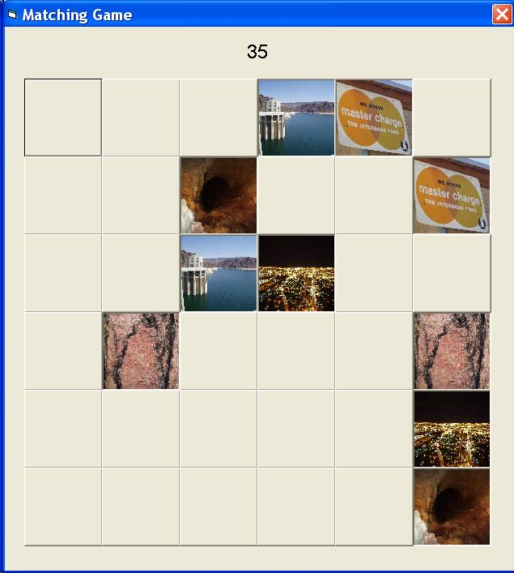



## JPG Matching Memory Game

### Description

This VB6 program allows you to specify a directory to search for jpg files in. It then randomly selects your images for a memory matching game.
 
### More Info
 
I'm a beginner at this, so there is probably a better way to do what I did, but it seems to work fine for me. *UPDATE* Sorry, I first posted this program with an error. It should work now.

             |
---                |---
**Submitted On**   |2005-06-03 19:57:08
**By**             |[Martin O\.](https://github.com/Planet-Source-Code/PSCIndex/blob/master/ByAuthor/martin-o.md)
**Level**          |Intermediate
**User Rating**    |5.0 (10 globes from 2 users)
**Compatibility**  |VB 6\.0
**Category**       |[Games](https://github.com/Planet-Source-Code/PSCIndex/blob/master/ByCategory/games__1-38.md)
**World**          |[Visual Basic](https://github.com/Planet-Source-Code/PSCIndex/blob/master/ByWorld/visual-basic.md)
**Archive File**   |[JPG\_Matchi189803662005\.zip](https://github.com/Planet-Source-Code/martin-o-jpg-matching-memory-game__1-60890/archive/master.zip)

